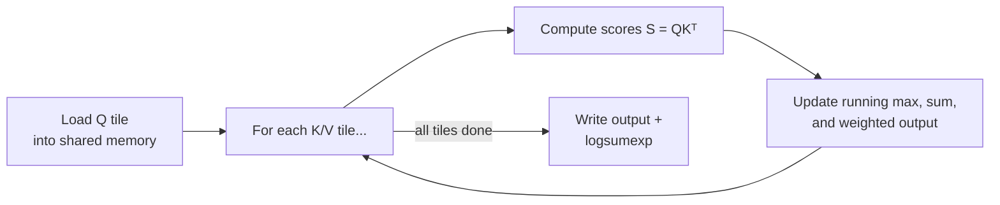
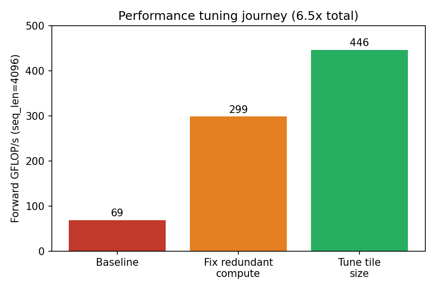
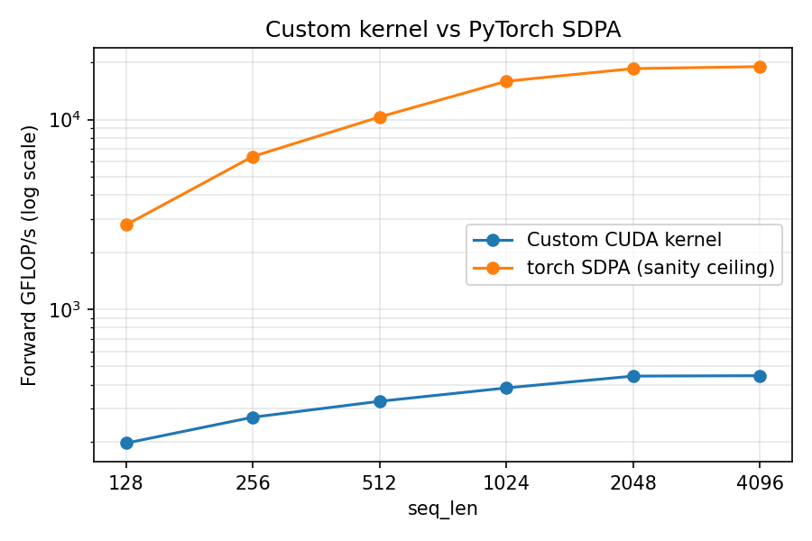

# Flash Attention in CUDA

This is a in-progress CUDA implementation of FlashAttention, which is the attention algorithm behind most modern transformers. It includes a full forward and backward pass, multi-head/batch support, and
fp32/fp16/bf16 precision.
 
## What's Included

- Implementation of tiled online-softmax attention, with forward and backward passes
- Reading of GPU profiler output (`nsight-compute`) and turning it into measured fixes
- Correctness testing against PyTorch autograd across dtypes (fp32/fp16/bf16) and causal/non-causal masking
- Performance framing: knowing  why a hand-written kernel is slower than a production one

## How it works

Standard attention computes `softmax(QK^T / sqrt(d)) V` by materializing the full `seq_len x seq_len` score
matrix. FlashAttention never materializes that matrix — it streams K/V in tiles and keeps a running ("online")
softmax as it goes:



The backward pass reuses that saved `logsumexp` to recompute scores tile-by-tile instead of storing the full
attention matrix's gradient.

## Performance engineering

Three `nsight-compute` profiling passes drove key fixes:



**Redundant computation:** the profiler showed the SM at 91% busy but almost no useful throughput. The cause was every thread in a query row was redundantly
   recomputing the same `Q·K` dot product (up to 128x). To fix it, I computed each score once, and shared it
   via shared memory. 


**Choosing tile size:** with the redundant math gone, the kernel became memory-bound from too many small tiles.
   To fix it, I swept `KEY_TILE_SIZE` from 4 to 64 and picked 32, which was the best tradeoff between memory usage and performance.

## How far is this from production?

`benchmarks/bench_vs_sdpa.py` compares this kernel against `torch.nn.functional.scaled_dot_product_attention`
(PyTorch's fused, tensor-core-backed attention kernel) at identical shapes.




SDPA is 14–43x faster and plateaus right at the A100's fp32 roofline (~19.5 TFLOP/s) due to major advantages in hardware:

- **Tensor cores:** This kernel does every multiply as scalar fp32 FMA, one value per thread. SDPA dispatches
  to MMA/WGMMA tensor-core instructions that process a whole matrix tile per instruction.
- **Occupancy:** Capped at 50% here (register + shared-memory limits), vs. production kernels using warp
  specialization and `cp.async` pipelining to keep far more warps in flight.
- **Thread mapping:** One output element per thread is the right choice for learning the algorithm clearly,
  but it can't dispatch to tensor cores without a fundamentally different design.


## Precision support

Forward, backward, and the delta-precompute kernels are templated on `scalar_t` (`float`/`__half`/
`__nv_bfloat16`). All arithmetic stays in fp32 internally regardless of storage dtype; only the final writes
narrow to the storage type. `tests/test_attention_precision.py` validates fp16/bf16 against a PyTorch
reference rounded through the same dtype, at a loosened tolerance.

## Repo structure

```
csrc/
  flash_attention_utils.cuh   # forward + backward kernels, host launchers, precision helpers, AttentionConfig
  flash_attention.cu          # main() driver: runs forward+backward for causal/non-causal/fp16/bf16, writes build/*.bin
benchmarks/
  bench_flash_attention.cu    # forward+backward latency/GFLOP-s sweep across seq_len
  bench_vs_sdpa.py            # custom kernel vs torch SDPA, same shapes
scripts/
  build_flash_attention.sh / run_flash_attention.sh   # build/run the main correctness driver
  build_benchmark.sh / run_benchmark.sh               # build/run the CUDA-only benchmark
  sweep_tile_sizes.sh                                 # rebuilds+reruns the benchmark across KEY_TILE_SIZE values
  generate_readme_charts.py                           # regenerates assets/*.png from measured results
tests/
  test_attention_correctness.py, test_attention_backward.py, test_cuda_vs_pytorch.py,
  test_attention_precision.py, test_attention_shapes.py, test_causal_masking_logic.py, verify_gpu.py
```

## Building and running

Requires an NVIDIA GPU with a CUDA toolchain (developed against  A100).

```bash
# Build + run
bash scripts/build_flash_attention.sh
bash scripts/run_flash_attention.sh

# Correctness / precision / shape / causal-masking tests against PyTorch
python tests/test_cuda_vs_pytorch.py
python tests/test_attention_backward.py
python tests/test_attention_correctness.py
python tests/test_attention_precision.py
python tests/test_attention_shapes.py
python tests/test_causal_masking_logic.py

# Benchmark the custom kernel alone
bash scripts/build_benchmark.sh
bash scripts/run_benchmark.sh


# Check against torch SDPA
python benchmarks/bench_vs_sdpa.py
```
